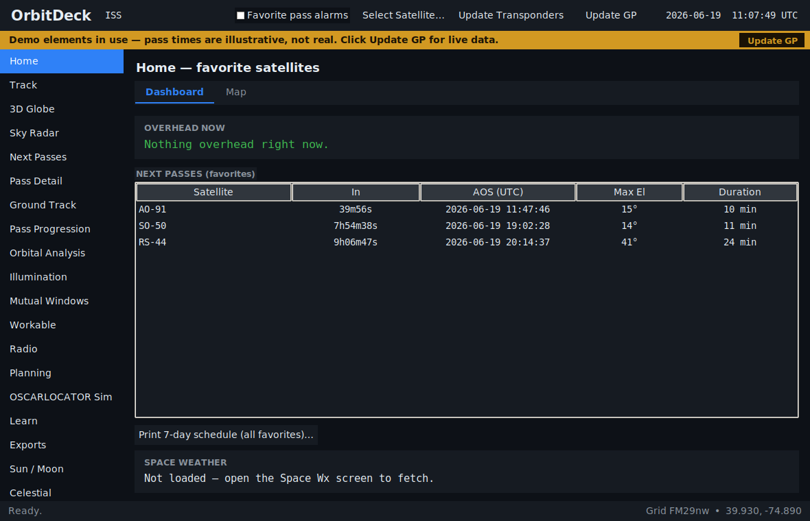
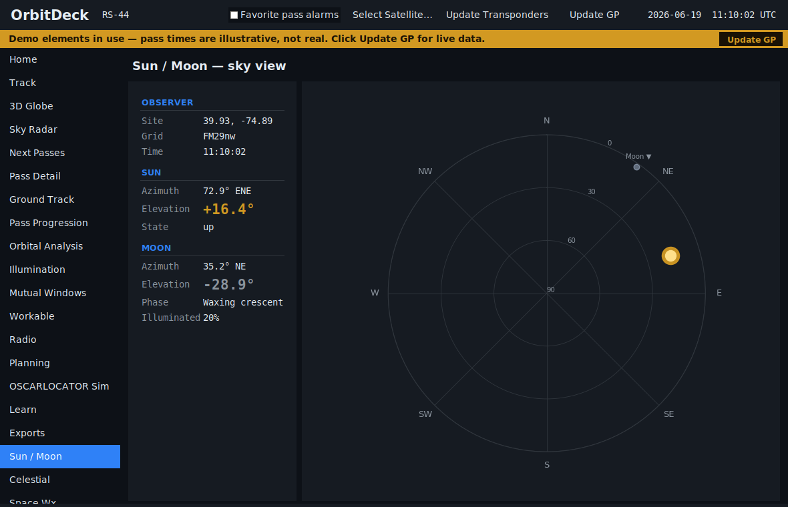
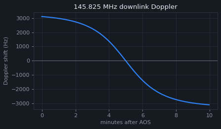

# OrbitDeck

**Cross-platform desktop satellite tracking & orbital analysis for amateur-radio operators.**

OrbitDeck is a desktop port of the tracking and orbital-analysis tools from the
[CardSat](https://github.com/) M5Stack Cardputer satellite tracker. It keeps the
analysis brain of that project and gives it a roomy desktop UI with embedded
plots — **tracking and analysis only**. Radio (CAT) and rotator control are
intentionally out of scope; excellent dedicated tools already cover that, and
the original device handles it on the hardware side.

It uses the reference [`sgp4`](https://pypi.org/project/sgp4/) propagator and
[`cartopy`](https://pypi.org/project/Cartopy/) (both **required dependencies**,
installed automatically) for accurate SGP4/SDP4 across low-Earth and deep-space
orbits and full-resolution coastlines. A pure-Python propagator and a bundled
coastline set ship as fallbacks.

<p align="center">
  
</p>

---

## Quick start

```bash
git clone https://github.com/prstoetzer/orbitdeck
cd orbitdeck
pip install -e .
orbitdeck
```

Or without installing:

```bash
pip install -r requirements.txt
python run.py
```

On first launch OrbitDeck loads a small bundled catalog (ISS, SO-50, AO-91,
CAS-4B, RS-44) so every screen works immediately offline. Click **Update GP
(online)** to pull the live AMSAT catalog, and use the **Satellites** screen to
fetch SatNOGS transponder data for the selected bird.

> ⚠️ **Pass times from the bundled catalog are illustrative, not real.** The
> demo elements are stamped to the current date so the geometry is sensible, but
> their orbital *phase* is synthetic — they will not tell you when a satellite
> is actually overhead. A yellow banner reminds you while demo (or stale) data
> is loaded. **Click *Update GP (online)* for accurate, on-the-air pass times.**
> SGP4 is only trustworthy within ~1–2 weeks of an element set's epoch, so
> refresh periodically.

### Optional extras

`sgp4` (full SGP4/SDP4) and `cartopy` (high-resolution coastlines) are both core
dependencies installed automatically by the commands above. The `accurate`,
`maps`, and `full` extras are kept only as backward-compatible no-op aliases.

> **tkinter note:** the python.org installers for Windows and macOS include
> tkinter. On Linux: `sudo apt install python3-tk` (Debian/Ubuntu) or
> `sudo dnf install python3-tkinter` (Fedora).

---

## Features

The table below lists the screens **in the exact order they appear in the
left-hand navigation menu**.

| # | Screen | What it shows |
|---|---|---|
| 1 | **Home** *(default)* | World map of all **favorited** satellites with their footprints, the day/night terminator and your station; click one to focus it with its ground track. A second tab lists the **next pass of every favorite with a live countdown**, and prints a 7-day schedule for all favorites. |
| 2 | **Track** | Live azimuth/elevation, slant range, range-rate, sub-point, altitude, transponder selector (FM/linear/beacon/data, passband, baud) and Doppler-corrected RX/TX using the passband **center** for linear transponders, sunlit/eclipse, next AOS/LOS, and a live sky polar plot. You can **add a manual transponder** and **export a printable OSCARLOCATOR PDF** for the selected satellite. |
| 3 | **Next Passes** | Pass table for the next 7 days with selectable minimum elevation; double-click a pass for its detail. Prints a **3-day grid of polar sky tracks**. |
| 4 | **Pass Detail** | Polar sky-track plus an elevation-vs-time profile for a chosen pass. |
| 5 | **Ground Track** | Forward ground track over the next 1, 3, 5, or 8 upcoming orbits. |
| 6 | **Orbital Analysis** | Eleven pages (see the manual): Info, Live, Next Pass, Ground Track, Doppler, Nodal, Sun/Beta, Pass Outlook, Orbit Position, Equ. Crossings, and Crossings List. Clean grouped data cards and plots. |
| 7 | **Illumination** | Scrollable 30-day sunlit-vs-eclipse raster; prints a 60-day summary with mean eclipse fraction. |
| 8 | **Pass Progression** | One satellite's passes across 10+ days as a scrollable stack of 24-hour timelines — each pass placed at its time of day, width = duration, shaded by max elevation. |
| 9 | **Mutual Windows** | Co-visibility windows between you and a DX station (entered as a grid or lat,lon). |
| 10 | **Workable** | What's inside the footprint — **grids**, **US states**, or **DXCC entities** — live (now) or unioned across the next pass, for grid/state/DX chasing. |
| 11 | **OSCARLOCATOR Sim** | An interactive on-screen OSCARLOCATOR: rotate the path-arc overlay over a polar or QTH base map and watch the satellite position and QTH footprint move, without printing transparencies. Drive it live, by hand (EQX-longitude and minutes-after-EQX sliders), or seed it to the next pass; a compact next-equator-crossings list is built in. Exports the matching printable PDF. |
| 12 | **Sun / Moon** | Solar and lunar az/el for your site, plus Moon phase and illumination. |
| 13 | **Space Wx** | Solar 10.7 cm flux, planetary Kp, and A index from NOAA SWPC, with plain-language levels and an operating outlook. Cached for offline viewing. |
| 14 | **Satellites** | The catalog: filter, select, favorite (★), fetch transponders, and **add manually-entered satellites** (by GP mean elements) that persist across refreshes. |
| 15 | **Settings** | Set your observer site by lat/lon/altitude or Maidenhead grid, choose the **GP element source** (AMSAT, a CelesTrak category, or a custom OMM-JSON URL), and set the **minimum elevation** used across pass tables and reports. |

Every satellite-specific screen has a **Report…** button that saves a clean,
printable PDF for the selected satellite — a comprehensive document with orbital
analysis, next passes, the equator-crossing schedule, a 3-day sky-track grid, the
60-day illumination raster and the 30-day pass progression. Additional one-click
reports print a **7-day favorites schedule** (Home), **mutual windows** (Mutual
Windows), a **60-day illumination** summary (Illumination), a **30-day pass
progression** (Pass Progression), and a **3-day sky-track grid** (Next Passes).

For full, step-by-step documentation of every screen and workflow, see
**[the OrbitDeck manual](docs/MANUAL.md)**.

<p align="center">
  
  &nbsp;&nbsp;
  
</p>

Settings, favorites, your site and the cached catalog persist under
`~/.orbitdeck/`.

---

## Accuracy & the SGP4 backend

The orbital core is a faithful port of the device's math, using the **WGS72**
gravity model to match the GP/TLE mean elements. Conventions carried over
verbatim:

* range-rate (for Doppler) is taken from the **SGP4 velocity vector**, not by
  differencing slant range;
* eclipse uses the **cylindrical Earth-shadow** test;
* beta angle is the orbit-plane-to-Sun angle;
* mutual windows are true two-station co-visibility.

**Propagation backend.** OrbitDeck uses the reference
[`sgp4`](https://pypi.org/project/sgp4/) package (full SGP4/SDP4) by default — it
is a required dependency. A dependency-free pure-Python implementation,
`orbitdeck/engine/sgp4_lite.py`, is bundled as a fallback; it is verified against
the canonical Vallado *AIAA-2006-6753* reference vector (catalog 88888) to about
**one centimetre** at epoch and is accurate for **near-Earth LEO** — essentially
every FM and linear amateur satellite (SO-50, the AO/FO/CAS birds, the ISS,
RS-44, etc.).

**Deep-space orbits (GEO/HEO).** For deep-space orbits (orbital period ≥ 225 min
— e.g. the geostationary QO-100 / Es'hail-2, AO-7's ~12-hour orbit, or
Molniya-type orbits), full reference SDP4 is required for correct positions, so
the [`sgp4`](https://pypi.org/project/sgp4/) reference propagator is a **required
dependency** and OrbitDeck uses it automatically. If for some reason `sgp4` is
not installed, OrbitDeck falls back to its bundled pure-Python propagator, whose
deep-space terms are only approximate — in that state it **flags affected
satellites in the header with a reduced-accuracy warning**, because an
approximate model can mis-place a geostationary bird badly enough to imply it
rises and sets when it does not. Reinstall the dependency to restore full
accuracy:

```bash
pip install sgp4
```

`orbitdeck/engine/propagator.py` selects the C-accelerated full SDP4 backend at
runtime when `sgp4` is importable — no configuration needed.

---

## Use the engine without the GUI

`orbitdeck.engine` has no GUI dependency, so you can script with it:

```python
import time
from orbitdeck.engine import SatDb, Predictor, Observer

db = SatDb()
db.load_gp_json(open("gp.json").read())

pred = Predictor()
pred.set_site(Observer(lat=39.93, lon=-74.89, alt_m=20, valid=True))
pred.set_sat(db.get(25544))               # ISS

for p in pred.predict_passes(time.time(), min_el=5.0, max_n=5):
    print(p.aos, round(p.max_el, 1))
```

---

## Project layout

```
orbitdeck/
├─ run.py                      dev entry point (python run.py)
├─ pyproject.toml              packaging + `orbitdeck` console script
├─ tests/                      engine tests (Vallado vector, passes, Doppler…)
└─ orbitdeck/
   ├─ engine/                  portable orbital core (no GUI)
   │  ├─ sgp4_lite.py          vendored pure-Python SGP4/SDP4 (WGS72)
   │  ├─ propagator.py         backend selector (reference sgp4, lite fallback)
   │  ├─ satdb.py              GP/OMM + SatNOGS parsing, SatEntry/Transponder
   │  └─ predict.py            look angles, passes, Doppler, eclipse, beta,
   │                           footprint, mutual windows, Maidenhead grid
   ├─ data/                    bundled offline catalog + simplified coastline
   └─ gui/                     Tkinter app
      ├─ app.py                main window, nav, theme, clock loop
      ├─ store.py              state, persistence, online fetch (stdlib only)
      ├─ mapdraw.py            world basemap (cartopy if present, else bundled)
      └─ screens/              one module per screen
```

---

## Data sources

* **GP elements:** AMSAT daily bulletin (`newark192.amsat.org`).
* **Transponders:** SatNOGS DB transmitters API.

Both are fetched with the Python standard library only; no API key required.

---

## Testing

```bash
pip install -e ".[dev]"
pytest -q
```

CI runs the suite on Python 3.8/3.10/3.12. Although `sgp4` is a required
dependency, the suite also runs **without** it so the bundled fallback
propagator is guaranteed correct on its own (with deep-space orbits flagged as
approximate, as the app does at runtime).

---

## What was intentionally left out

Per the project's scope, none of CardSat's **radio/CAT control** (Icom CI-V,
Yaesu, Kenwood, IcomNet, `rigctld`) or **rotator control** (`rotctld`) was
ported. The engine still computes the Doppler-corrected frequencies and look
angles those subsystems would consume, so a rig/rotator bridge could be added
later — but it is not part of OrbitDeck.

## Coverage vs CardSat (tracking & analysis)

OrbitDeck implements the full tracking and orbital-analysis surface of the
device:

Satellites catalog; all nine Orbital-Analysis pages (Info, Live, Next Pass,
Ground Track, Doppler, Nodal/J2, Sun-Beta, Pass Outlook, Orbit Position); Next
Passes; Pass detail & polar; Mutual windows; multi-day pass progression; 60-day
illumination; live Track; world map with footprint and terminator; Sun/Moon;
**Workable grids, US states, and DXCC**; **Space Weather** (F10.7 / Kp / A from
NOAA SWPC); Location; GP-age warnings; online GP (AMSAT) and transponder
(SatNOGS) fetch.

The only CardSat features intentionally excluded are **radio (CAT) and rotator
control** — see above.

**Notes on the workable overlays.** Grids are computed geometrically (no bundled
data). US states use multi-point interior sampling per state, and DXCC uses
per-entity reference points for a practical set of the commonly worked / spread
entities (the point half of CardSat's hybrid model). Both are footprint-scale
accurate and intentionally lightweight; a footprint grazing a border may briefly
list a neighbour, which is correct at footprint scale (both are workable).

---

## License

MIT — see [LICENSE](LICENSE).

OrbitDeck is an independent port; satellite tracking math follows the public
Vallado SGP4 reference. "CardSat" refers to the original device project this was
ported from.
