# OrbitDeck — User Manual

OrbitDeck is a cross-platform desktop application for **satellite tracking and
orbital analysis**, aimed at amateur radio operators working the FM, linear, and
digital birds, with a roomy windowed interface and embedded plots.

Radio (CAT) and rotator control are intentionally **out of scope** — OrbitDeck
tells you where a satellite is, when it will be in range, how to point, and what
Doppler to expect, but it does not key your radio or turn your rotator.

This manual documents every screen in the order it appears in the navigation
menu, plus the printable OSCARLOCATOR system, the report exports, and the data
sources.

---

## Contents

1. [Getting started](#1-getting-started)
2. [The application window](#2-the-application-window)
3. [The navigation menu (in order)](#3-the-navigation-menu-in-order)
   - [1. Home](#31-home)
   - [2. Track](#32-track)
   - [3. 3D Globe](#33-3d-globe)
   - [4. Sky Radar](#34-sky-radar)
   - [5. Next Passes](#35-next-passes)
   - [6. Pass Detail](#36-pass-detail)
   - [7. Ground Track](#37-ground-track)
   - [8. Orbital Analysis](#38-orbital-analysis)
   - [9. Radio](#39-radio)
   - [10. Planning](#310-planning)
   - [11. Illumination](#311-illumination)
   - [12. Pass Progression](#312-pass-progression)
   - [13. Mutual Windows](#313-mutual-windows)
   - [14. Workable](#314-workable)
   - [15. OSCARLOCATOR Sim](#315-oscarlocator-sim)
   - [16. Learn](#316-learn)
   - [17. Exports](#317-exports)
   - [18. Sun / Moon](#318-sun--moon)
   - [19. Celestial](#319-celestial)
   - [20. Space Wx](#320-space-wx)
   - [21. Satellites](#321-satellites)
   - [22. Sites](#322-sites)
   - [23. Settings](#323-settings)
4. [The OSCARLOCATOR system](#4-the-oscarlocator-system)
5. [Reports (printable PDFs)](#5-reports-printable-pdfs)
6. [Data sources & staying accurate](#6-data-sources--staying-accurate)
7. [Files & where settings live](#7-files--where-settings-live)
8. [OrbitTerm — the terminal UI](#8-orbitterm--the-terminal-ui)
9. [Troubleshooting](#9-troubleshooting)
10. [Author & supporting AMSAT](#10-author--supporting-amsat)

---

## 1. Getting started

Install and launch:

```bash
pip install -e .
orbitdeck
```

Or run without installing:

```bash
pip install -r requirements.txt
python run.py
```

> **Installing Python and per-platform steps.** Full instructions for
> **Windows, macOS, Debian/Ubuntu, Fedora, Arch, and Raspberry Pi OS** —
> including installing Python and Tkinter and building a standalone app — are in
> **[INSTALL.md](INSTALL.md)**. On Linux, Tkinter is a separate package
> (`python3-tk`, `python3-tkinter`, or `tk`).

> **Optional extras are strongly recommended.** OrbitDeck runs on bundled
> pure-Python building blocks, but `pip install "orbitdeck[full]"` adds the
> C-accelerated `sgp4` propagator (faster, and fully accurate for deep-space
> birds), `cartopy` high-resolution coastlines, and native `.xlsx` export.
> Install them unless you have a reason not to.

On first launch OrbitDeck loads a small **bundled demo catalog** (ISS, SO-50,
AO-91, CAS-4B, RS-44) so every screen works immediately, even offline.

> **Important — demo pass times are not real.** The bundled elements are stamped
> to today's date so the geometry looks sensible, but their orbital *phase* is
> synthetic. They will **not** tell you when a satellite is actually overhead. A
> yellow banner appears whenever demo or stale data is loaded. Click **Update
> GP** in the top bar to download live elements, then your pass times are real.

Because SGP4 is only trustworthy within roughly **one to two weeks** of an
element set's epoch, refresh your elements periodically.

**First-run checklist**

1. Open **Settings** (last menu item) and set your **observer site** — latitude,
   longitude, and altitude, or a Maidenhead grid square.
2. Click **Update GP** in the top bar to pull a live catalog.
3. Open **Satellites**, select the birds you care about, and press **space** to
   favorite them (★). Favorites drive the Home map and the favorites schedule.
4. Optionally, on **Satellites**, fetch transponder data for a selected bird so
   the Track screen can show Doppler-corrected frequencies.

---

## 2. The application window

The window has three parts:

- **Top bar** — application-wide actions, including **Update GP** (download a
  fresh element set from your configured source) and **Update Transponders**
  (refresh the SatNOGS transponder database). A **Favorite pass alarms** toggle
  raises in-app **AOS / TCA / LOS** notifications — plus a one-minute "rising
  soon" warning — for the next pass of **every favorited satellite**, so you
  don't miss a rising bird while working in another screen or watching a
  different satellite. Each event has its own **distinctive beep rhythm** (a
  rising three-beep warning, a firm double at AOS, a single chime at TCA, and a
  descending three-beep at LOS) so you can tell them apart by ear. A **yellow
  banner** appears here when the loaded catalog is
  demo or stale data; it also carries an Update GP button.
- **Navigation menu** (left) — all 23 screens, described below.
- **Content area** (right) — the active screen.

Most screens act on the **currently selected satellite**, shown in a header
badge. Change the selection on the **Satellites** screen (or by clicking a
favorite on the Home map). Each satellite-specific screen also carries a
**Report…** button (see [Reports](#5-reports-printable-pdfs)).

Times are shown in **UTC** throughout, the convention for satellite operating.

---

## 3. The navigation menu

### 3.1 Home

<p align="center"></p>

The default screen. Two tabs:

- **Dashboard** — the at-a-glance view: **Overhead now** (any favorites currently
  above your horizon, with az/el), **Next passes** across all favorites (soonest
  first, with a live "In" countdown, max elevation and duration; double-click a
  row to select that satellite), a one-click **"Print 7-day schedule (all
  favorites)"** PDF button, and a **Space weather** glance (SFI / Kp from the
  last fetch).
- **Map** — a world map showing **every favorited satellite** with its current
  footprint, the day/night terminator, and your station. Click a satellite in
  the side list to focus it and draw its ground track.

Home is the at-a-glance "what can I work soon" view. (For each favorite's next
pass with quality scores and track directions, see the **Next Passes** screen.)

> **Keyboard shortcuts** (work anywhere except while typing in a field):
> `Ctrl`+`K` opens a command palette to jump to any screen or satellite; `Ctrl`+`F`
> or `/` finds a satellite; `[` and `]` step to the previous / next satellite;
> `1`–`9` jump to a sidebar screen; `Ctrl`+`+` / `Ctrl`+`-` / `Ctrl`+`0` change the
> text size; `F1` or `?` shows the full list.

### 3.2 Track

<p align="center">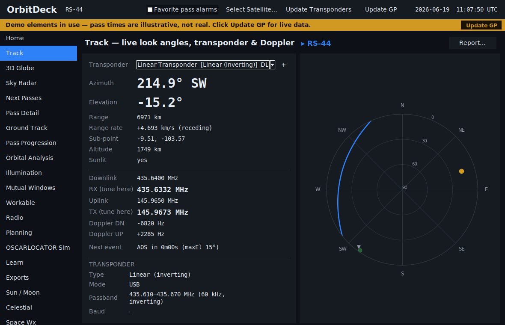</p>

The live operating screen for the selected satellite. It shows:

- **Look angles** — azimuth, elevation, slant range, and range-rate, updated
  live.
- **Sub-point and altitude** — where the satellite is over the Earth.
- **Transponder selector** — pick a transponder (FM, linear, beacon, or data);
  details include the passband and baud rate.
- **Doppler-corrected frequencies** — live downlink (DN) and your corrected
  receive (RX), plus uplink (UP) and corrected transmit (TX). For linear
  transponders the correction uses the passband **center**.
- **Sunlit / eclipse** status and the next **AOS / LOS** times.
- A **live sky polar plot** of the current pass.

You can **add a manual transponder** if the database lacks one, and **export a
printable OSCARLOCATOR PDF** for the selected satellite from here (see
[The OSCARLOCATOR system](#4-the-oscarlocator-system)).

### 3.3 3D Globe

<p align="center">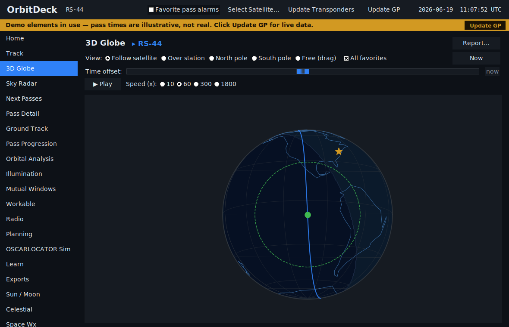</p>

A rotatable **orthographic "view from space"** of the Earth showing **all your
favorite satellites at once, live** — each as a coloured dot with its coverage
footprint and a name label — over the day/night terminator and your station. The
**selected** satellite is emphasized (it carries its ground track and a brighter
footprint), and the chosen **View** follows it.

- **View** (radio buttons): **follow the satellite** (it stays centred),
  **over your station**, look straight down the **north** or **south** pole, or
  **Free (drag)** — click and drag anywhere on the globe to spin it to any
  viewpoint and hold it there. (Starting a drag from any other view switches to
  Free automatically.)
- **All favorites** (checkbox): show every favorite live, or untick to show only
  the selected satellite.
- **Time scrubber** — a slider spanning **±180 minutes** flies the whole scene
  forward or backward in time, so you can watch a pass develop or rewind one.
  **Play** animates it; the **speed** control sets how fast (10× to 1800×). Click
  **Now** to snap back to the present. At "now", the favorites advance in **real
  time**.

A favorite on the far side of the globe (over the horizon from the current
viewpoint) is hidden until it rotates into view. The orange star is your station.

### 3.4 Sky Radar

<p align="center">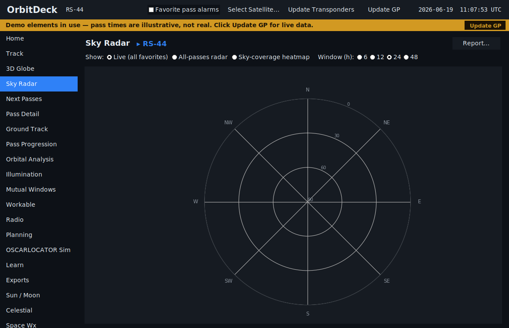</p>

A polar sky plot (N-up, zenith at centre, rim = horizon) with three modes chosen
by the radio buttons:

- **Live (all favorites)** *(default)* — the **current sky position** of every
  favorite satellite that is **above your horizon right now**, each a coloured
  labelled dot, updating in **real time** as they move. This is the "what can I
  hear right now" view.
- **All-passes radar** — the upcoming passes of the **selected** satellite
  overlaid on one plot (each arc one pass, colour-coded by order, with a dot at
  AOS), over a selectable window (6–48 h). Good for "what is my sky doing in the
  next few hours."
- **Sky-coverage heatmap** — the selected satellite's upcoming passes aggregated
  into an azimuth × elevation density map: brighter cells are where it spends
  more time in your sky. Useful for planning antenna patterns or spotting where a
  treeline or building will block passes.

### 3.5 Next Passes

<p align="center">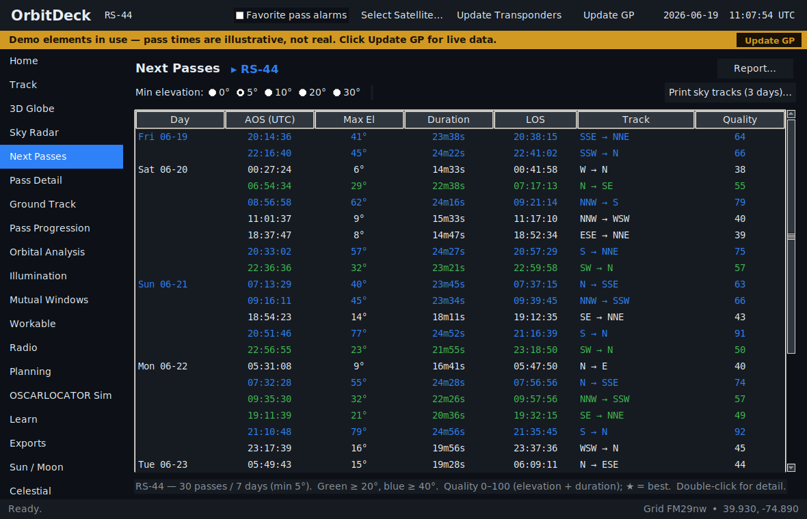</p>

A table of upcoming passes for the selected satellite over the next 7 days. A
**minimum-elevation** control filters out passes too low to be useful (presets
plus whatever you set in Settings). Each pass carries a **quality score** (0–100,
combining peak elevation and duration), with the best upcoming pass flagged with
a ★, so you can quickly see which passes are worth working. **Double-click** a
pass to open it in Pass Detail. A button prints a **3-day grid of polar sky
tracks** as a PDF.

### 3.6 Pass Detail

A detailed look at one chosen pass: a **polar sky-track** (the path across your
sky, N-up, zenith at center) alongside an **elevation-versus-time** profile.
Reached by double-clicking a pass on Next Passes.

### 3.7 Ground Track

<p align="center">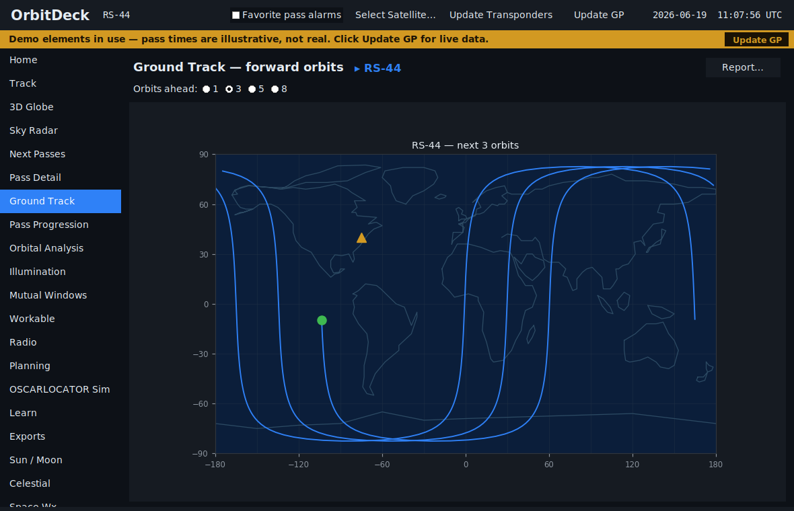</p>

The selected satellite's **forward ground track** over the next **1, 3, 5, or 8
orbits** (selectable with the radio buttons), drawn on the world map so you can
see where it will pass.

### 3.8 Orbital Analysis

<p align="center">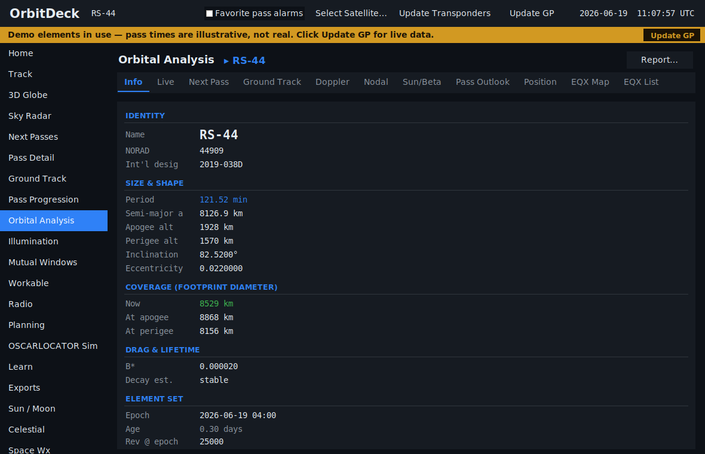</p>

Eleven pages of detailed analysis for the selected satellite, navigated with the
page control. Data pages are clean grouped key/value cards; graph pages embed a
plot.

1. **Info** — size/shape, footprint diameter now / at apogee / at perigee, the
   B\* drag-decay lifetime estimate, and element-set age.
2. **Live** — current look angles, dual-band Doppler, and eclipse depth.
3. **Next Pass** — slant ranges at AOS / TCA / LOS and one-way path delay.
4. **Ground Track** — the ground track plotted over upcoming orbits.
5. **Doppler** — the Doppler curve for a selectable downlink (from the
   transponder database); shows peak shift and maximum range-rate.
6. **Nodal** — J2 node and perigee drift rates, sun-synchronous flag, local time
   of ascending node (LTAN), repeat-ground-track period, and the longest
   geometrically possible pass.
7. **Sun/Beta** — beta angle now, the beta\* eclipse threshold, eclipse fraction,
   and a 60-day beta plot.
8. **Pass Outlook** — a 7-day planning summary with the best upcoming pass.
9. **Position** — mean and true anomaly, argument of latitude, and time to
   perigee / apogee.
10. **EQX Map** — ascending-node times and longitudes for the next 7
    days, charted in the style used to set an OSCARLOCATOR.
11. **EQX List** — the same equator crossings as a date/time/longitude
    table, with an **Export crossings CSV** button.

### 3.9 Radio

<p align="center">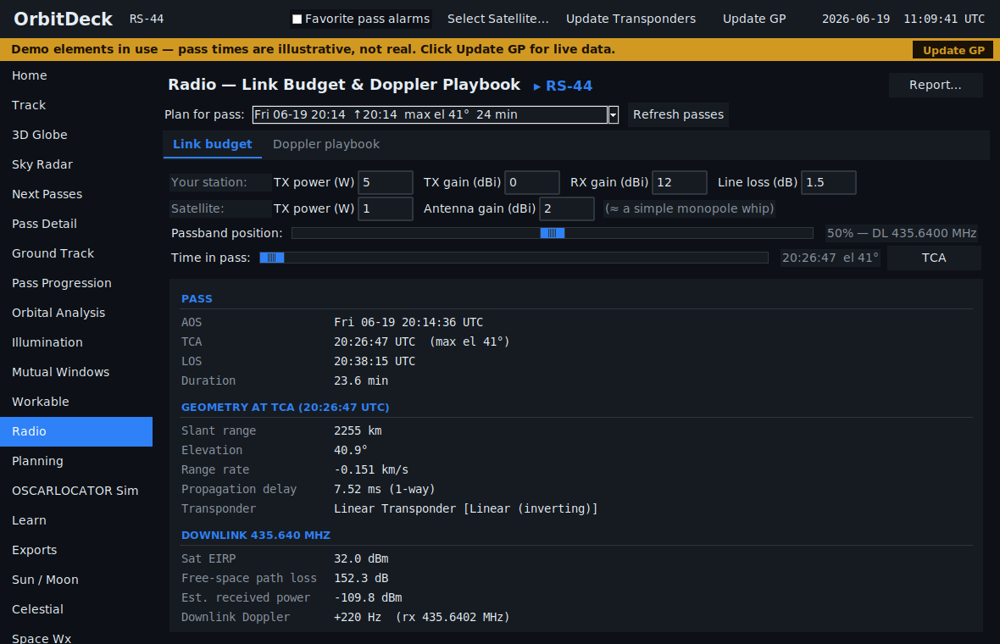</p>

Radio-planning analysis for the selected satellite, in two tabs. (OrbitDeck does
**not** control a radio — these are calculators that *inform* operating.)

A **Plan for pass** selector at the top lists the next several upcoming passes
(with date, max elevation, and duration); pick one and **both** tabs plan against
it. **Refresh passes** re-scans. With a pass chosen, the link budget defaults to
that pass's **TCA** (closest approach — the best-case geometry), and the Doppler
playbook is generated for that pass's AOS→LOS span.

- **Link budget** — for the chosen geometry: the **slant range**, one-way
  **propagation delay**, **range rate**, **free-space path loss** on the downlink
  (and uplink), an **estimated received power**, and the **downlink Doppler** at
  that instant. You enter two sets of parameters: **Your station** (TX power,
  TX/RX antenna gains, line loss) drives the uplink and your receive side, and the
  **Satellite** (its TX power and antenna gain — defaulting to ~1 W into a ~2 dBi
  *simple monopole whip*) drives the downlink received power, since on the
  downlink the spacecraft is the transmitter. The figures use the **transponder
  you selected on the Track screen** (the two screens stay in sync). For a
  **linear transponder**, a **Passband position** slider lets you choose where in
  the passband you want to operate (0 % = low edge, 50 % = centre, 100 % = high
  edge). A **Time in pass** slider scrubs the geometry from **AOS to LOS** so you
  can watch range, path loss and Doppler change through the pass; the **TCA**
  button snaps back to closest approach. It's an estimate for "is this pass
  workable," not a calibrated measurement — override the inputs to match your
  station and the bird.
- **Doppler playbook** — a per-pass table of the **corrected RX and TX
  frequencies** at a chosen interval (30/60/120 s), with the satellite's
  **azimuth and elevation** at each step, for tuning (and pointing) by hand
  without a computer in the loop. For an **FM bird** each leg is corrected
  independently.
  For a **linear transponder worked full duplex**, choose which leg to **hold
  fixed** — **Fixed downlink** (you park your receiver and the table tells you
  where to set the uplink) or **Fixed uplink** (you park your transmitter and it
  tells you where you'll hear yourself). The non-fixed leg is **round-trip
  corrected** so you stay on your own signal as the satellite moves. A
  **Passband position** slider builds the table around where you are actually
  tuned in a linear bird's passband, rather than always the band centre. Export
  the table to **CSV** or a **printable PDF sheet**.

### 3.10 Planning

<p align="center">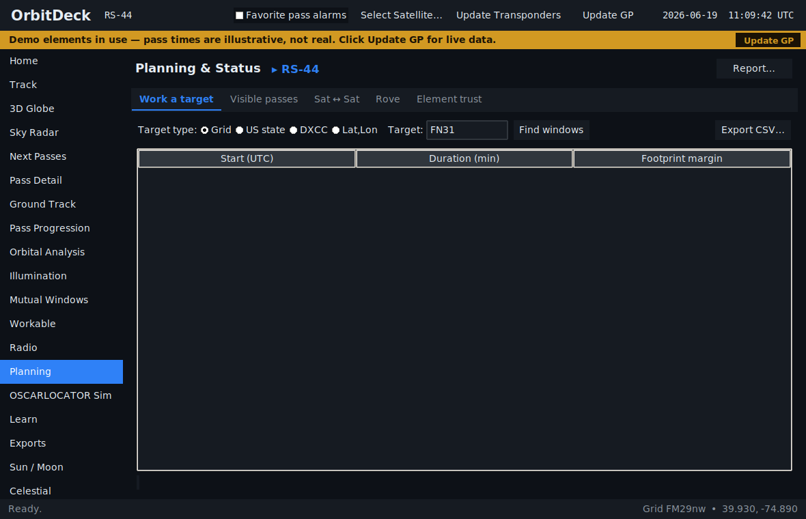</p>

Goal-directed planning and element-status, in four tabs:

- **Work a target** — pick a target as a **grid square**, a **US state**, a
  **DXCC entity** (chosen from a list), or **lat,lon**, and OrbitDeck finds the
  upcoming windows (next 72 h) when **both you and the target are inside the
  satellite's footprint** at once — i.e. a contact through the bird is
  geometrically possible. Windows are ranked by start time, with a
  footprint-margin figure (bigger = both stations nearer the centre
  of coverage). Export the windows to **CSV**.
- **Visible passes** — the next 5 days of **optically observable** passes: the
  satellite sunlit while you are in darkness and it is high enough to see. Choose
  the darkness threshold (**civil / nautical / astronomical** twilight) and a
  **standard magnitude** for the satellite; each pass shows an **estimated
  brightness**. Magnitudes are estimates — real satellites flare and tumble.
  Export the list to **CSV**.
- **Sat ↔ Sat** — enter a second satellite by **NORAD id or name** and choose a
  window (3–24 h); OrbitDeck lists the **line-of-sight windows** between the two
  satellites in a table with each window's **start, end, duration, and minimum
  range** (the closest the two spacecraft come during that window). A clear line
  of sight means the chord between them does not pass through the Earth. Export
  the windows to **CSV**. This is two-satellite **mutual visibility** — useful
  for inter-satellite link and crosslink planning.
- **Rove** — a route planner for **grid rovers**. Add each grid you plan to
  activate with the **date and approximate UTC time window** you'll be there,
  using the separate **Grid / Date / Start / End** fields and the **Add stop**
  button; the stops collect in an editable list (remove or clear as needed). The
  windows are **hints**, not hard filters: OrbitDeck shows the passes that
  **cover each stop** near its window, for the **selected satellite** or — with
  the **Satellites: Selected / All favorites** choice — for **every favorite at
  once**. For each pass it lists the **satellite**, the **US states**, **DXCC
  entities**, and the **grid count** workable while the stop is inside the
  footprint — so you can see what each stop lets you activate or work. Select a
  row to see the full state/DXCC list for that pass. Export the plan to **CSV**
  or a printable **rove sheet PDF**. (State coverage uses a bundled boundary
  dataset so it's accurate across each state's extent.)
- **Element trust** — the selected satellite's element-set **epoch age**, a
  coarse **trust level**, and an **along-track drift estimate**, with guidance on
  when to refresh. Quantifies the stale-data warning.

### 3.11 Illumination

<p align="center">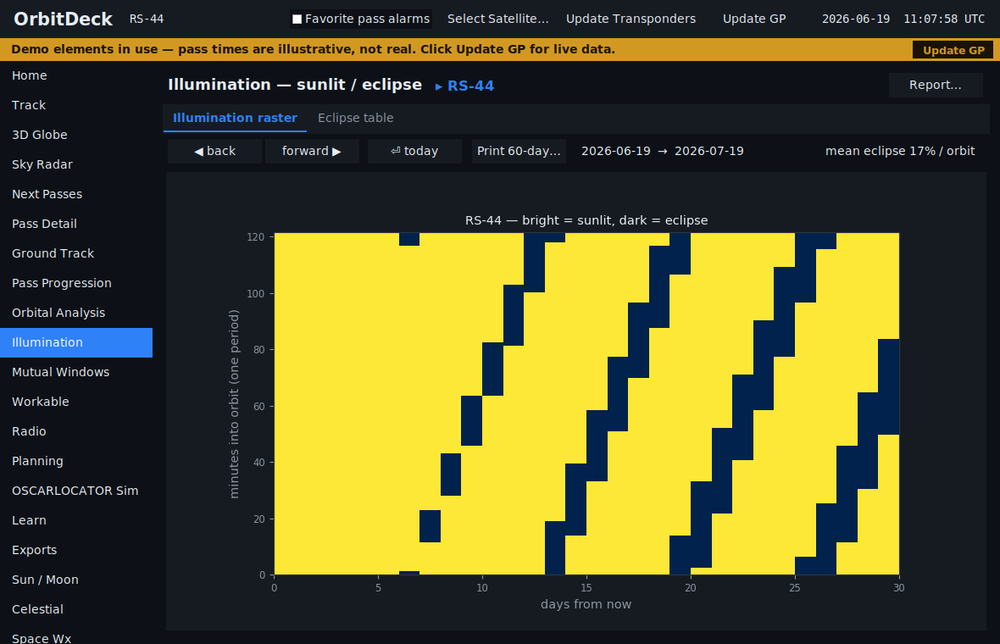</p>

Two tabs for the selected satellite's illumination.

- **Illumination raster** — a **sunlit-versus-eclipse raster** showing a 30-day
  window you can **scroll** forward and back through time (buttons or mouse
  wheel). Day runs along one axis and minutes-into-orbit along the other; bright
  is sunlit, dark is eclipse. A **Print 60-day** button exports the full summary,
  which reports the mean eclipse fraction — useful for power-budget reasoning.
- **Eclipse table** — a tabular **umbral-eclipse ephemeris** over a selectable
  span (1–14 days), in two sub-tabs. **Every orbit** lists each eclipse's
  **enter / exit / duration**, the **interval** of sunlight between successive
  eclipses, and the **sun angle** (the orbit-plane beta angle). **Daily summary**
  rolls each UTC day up into the **number of eclipses**, **total** eclipse time,
  the **longest** single eclipse, the **percent of the day** spent in shadow, and
  the day's sun angle. High beta angles mean shallow, short eclipses — or none at
  all in continuous sunlight. Both views export to **CSV**, and **Print report**
  produces a formatted PDF. This is the data you need for spacecraft
  power-budget planning.

### 3.12 Pass Progression

The selected satellite's passes across **10 or more days**, drawn as a scrollable
stack of **24-hour timelines** — one row per day. Each pass sits at its time of
day, its width is its duration, and its shade encodes max elevation. This is the
"how does my pass time drift day to day" view.

### 3.13 Mutual Windows

**Co-visibility** windows — the times when both you and a **DX station** can see
the same satellite simultaneously (the requirement for a direct satellite QSO).
Enter the DX station as a Maidenhead grid or as `lat,lon`. The **Satellite**
selector chooses the scope: **Selected** computes windows for the active
satellite, or **All favorites** scans every favorited satellite against the DX
station and lists all their windows together in one chronological table, each
tagged with its satellite. **Export CSV** saves the table, and a button prints
the mutual-windows report.

**Double-click any window** to open a detail view with two tabs.

The **Sky tracks** tab shows the pass on a polar sky plot **from each station's
perspective side by side** — your station on the left, the DX station on the
right. (In All-favorites mode the detail is built for that window's own
satellite.) Each plot draws that station's full pass in grey with the
**mutually-visible portion highlighted in bold orange**, and marks AOS (circle)
and LOS (square). This makes it easy to see when in the pass the satellite is
workable from both ends and how high it sits in each sky.

The **DX Doppler** tab predicts the **four radio dial frequencies** — your RX,
your TX, the DX's RX, the DX's TX — at 30-second steps across the window, so two
operators on a transponder can agree on where to tune to hear each other. Because
each station has different geometry, each sees a *different* Doppler shift; the
table accounts for that. Choose an operating policy:

- **True rule** — both stations work the **same spot in the satellite passband**,
  each applying its own Doppler. All four dials move. This is the natural
  "everyone holds the same point on the bird" approach.
- **Fixed downlink** / **Fixed uplink** — **lock one dial** of one station (chosen
  with the **Lock** selector: your TX/RX or the DX's TX/RX) to a single value for
  the whole window; the satellite-frame tuning then drifts so that dial stays put,
  and the other three move. Useful when one operator parks a radio and never
  touches it.

For a **linear** transponder a **Passband** slider chooses where in the passband
you're working (it's hidden for FM/single-channel birds). A `—` in a TX column
means the transponder is receive-only. **Export CSV** saves the full table (dial
frequencies in Hz). If the satellite has no transponder data, the tab explains
that the dials can't be computed.

### 3.14 Workable

<p align="center">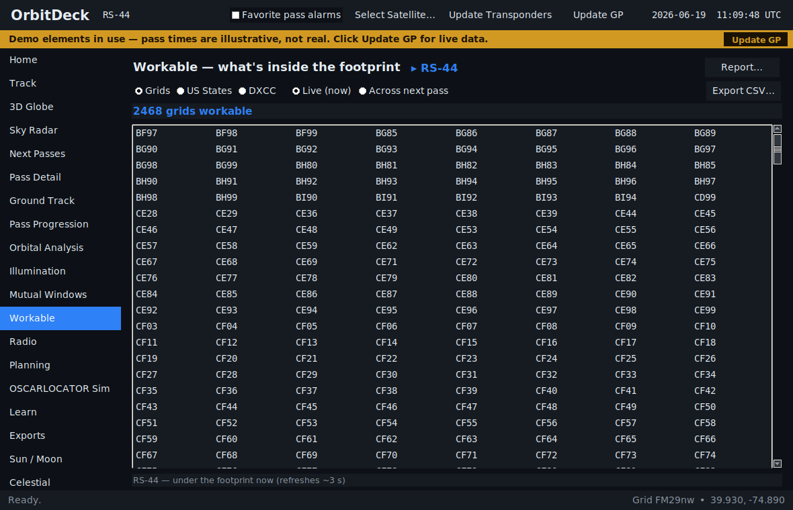</p>

What is **inside the satellite's footprint** — useful for grid-square, US-state,
and DXCC chasing. Choose the category with the radio buttons:

- **Grids** — Maidenhead grid squares.
- **US States** — states currently reachable.
- **DXCC** — DXCC entities currently reachable.

And choose the time mode:

- **Live** — what is under the footprint right now (refreshes every few seconds).
- **Pass** — the union of everything reachable across the next pass.

**Export CSV** saves the current list (grids, states, or DXCC entities) for the
chosen category and time mode.

### 3.15 OSCARLOCATOR Sim

<p align="center">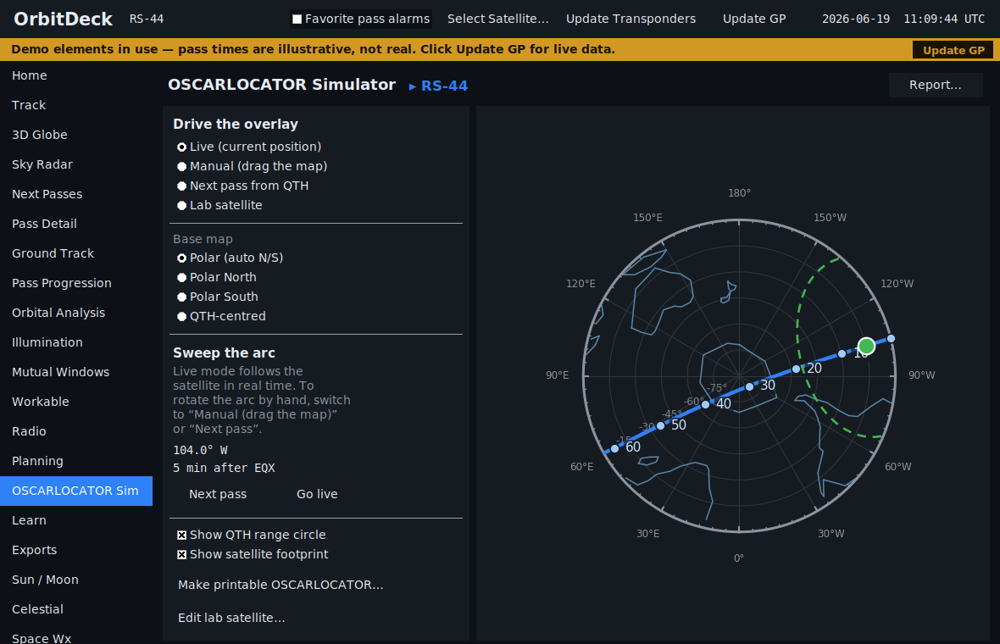</p>

An **interactive on-screen OSCARLOCATOR** — play with the classic transparency
tool without printing anything. The display is a polar (or QTH-centered)
azimuthal-equidistant base map with a **rotatable orbit path-arc overlay**, the
satellite's position marker, and the footprint. The map carries a
**protractor-style rim** with per-degree tick marks (longer every 30°) and a ring
of **longitude labels** (polar view) or **azimuth labels and cardinal letters**
(QTH-centered view), with latitude- and range-ring labels inside, so you can read
positions straight off the instrument.

**Drive modes** (radio buttons):

- **Live** — the overlay follows the satellite's real current position; the
  satellite's actual coverage footprint (green dashed) is drawn at its sub-point
  alongside the fixed QTH range reticle (orange).
- **Manual (drag the map)** — **drag anywhere on the disc** to rotate the whole
  ground-track arc to any **equator-crossing longitude** by hand, and **drag near
  the moving satellite dot** to step the **minutes after the crossing**; the
  marker slides along the drawn arc. This is exactly how you use a physical
  OSCARLOCATOR: line the node up on the equator-crossing longitude, then read
  along the track. Under the **Sweep the arc** heading, two sliders —
  **equator-crossing longitude** and **minutes after crossing** — set the same
  values; dragging the disc and the sliders share state, so moving one updates
  the other. The minute slider spans exactly one orbital period for the selected
  satellite.
- **Next pass** — seeds the overlay to the node of the next pass from your
  station.

Dragging works in every mode **except Live** (Live follows the satellite in real
time, so to take the arc over by hand you first pick **Manual**, **Next pass**,
or **Lab satellite**). The **Next pass** button jumps the hand-positioned arc to
the next visible pass to fine-tune from, and **Go live** resumes real-time
following. Hand-dragging works the same way for the **lab satellite** (below) as
for a catalog satellite, so you can sweep a hypothetical orbit by hand without
leaving lab mode.

**Base map** (radio buttons): polar auto (picks N or S from your latitude), polar
north, polar south, or QTH-centered.

Two independent overlay toggles let you show or hide each circle on its own:
**Show QTH range circle** (the fixed orange circle centred on your station) and
**Show satellite footprint** (the satellite's own coverage circle at its current
sub-point, green dashed).

A compact **"next equator crossings"** list is built into the page — the next few
node times and longitudes (ascending nodes for northern stations, descending for
southern). Click a row to drive the overlay straight to that crossing. There is
also a **"Make printable OSCARLOCATOR…"** button to export the matching PDF (see
§4 for the print options dialog).

The QTH range reticle is sized to the satellite's footprint radius at its **mean
orbital altitude** — i.e. the **maximum ground distance** at which the satellite
is ever visible. When the path arc touches or crosses that circle, the satellite
is above your horizon (within the natural tolerances of an overlay system).

#### Lab satellite

Choose **"Lab satellite"** under *Drive the overlay* to switch the
simulator from the catalog satellite to a hypothetical one you design yourself.
A pop-up **element editor** opens (reopen it any time with **"Edit lab
satellite…"**). For each orbital element there is a **slider and a linked numeric
entry box**, so you can drag for feel or type an exact value. The sliders **snap
to clean values** as you drag (whole km for altitude, 0.001 for eccentricity,
0.1° for the angles), so it's easy to land on the value you want:

<p align="center">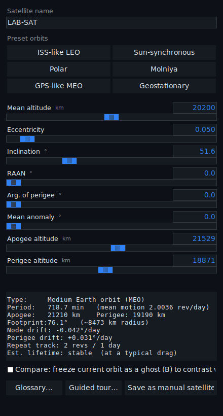</p>

- **Mean altitude** — the primary size control; the orbital **period** updates
  live as you change it (Kepler's third law).
- **Eccentricity** — how elongated the ellipse is; the apogee/perigee read-out
  spreads apart as you raise it.
- **Inclination** — the orbit-plane tilt; sets the maximum latitude reached.
- **RAAN**, **argument of perigee**, **mean anomaly** — the orientation and
  starting-position angles.

**Apogee / perigee.** Below the element sliders there are two more sliders —
**Apogee altitude** and **Perigee altitude** — each with its own entry box, just
like the other parameters. They aren't independent elements: moving either one
holds the other fixed and solves back for the mean altitude and eccentricity
(clamping to the safe range and telling you if it had to). They also update live
as you drag the altitude or eccentricity sliders, so you can dial an orbit in by
its high and low points or by mean size and shape — whichever is easier for the
orbit you have in mind.

As you edit, the map's path arc, footprint, and range circle update immediately,
and a **derived read-out** shows the period, mean motion, apogee/perigee
altitudes, footprint radius, and a plain-language **orbit type** ("Low Earth
orbit", "Molniya-like", "Geostationary", …). A one-line **explainer** describes
the effect of whatever you just changed.

Other tools in the editor:

- **Preset orbits** — load a recognisable archetype (ISS-like LEO,
  sun-synchronous, polar, Molniya, GPS-like MEO, geostationary) in one click,
  then perturb it.
- **Compare** — tick the box to freeze the current orbit as a faint dashed
  "ghost" on the map, then keep editing to see a single element's effect side by
  side.
- **Guided tour** — a short stepped walkthrough that drives the lab through
  altitude → footprint → inclination → latitudes → sun-synchronous → Molniya →
  reading a pass.
- **Glossary** — a scrollable reference of each element and derived quantity with
  its governing formula.

The lab satellite is **named** in the editor (the name appears on its printed
sheets) and is **ephemeral**: it exists only in the simulator until you press
**"Save as manual satellite"**, which stores it in the catalog (as a manual
satellite with a synthetic NORAD ≥ 99000) so it persists across element
refreshes. You can print your fictional satellite with **"Make printable
OSCARLOCATOR…"** exactly like any catalog bird.

The editor also reports the **J2 nodal/perigee precession** rates, a live
**sun-synchronous** verdict, the **ground-track repeat** cycle, and an estimated
**orbital lifetime** (so dropping the perigee toward 200 km visibly shortens it).
A **"Trace orbits"** control draws several successive orbits as fading tracks to
show the per-orbit westward drift, and **"Challenges…"** poses design goals
(cover a continent, repeat the track daily, build a sun-synchronous or
geostationary orbit, recreate a Molniya) and checks live whether your orbit meets
them.

### 3.16 Learn

<p align="center">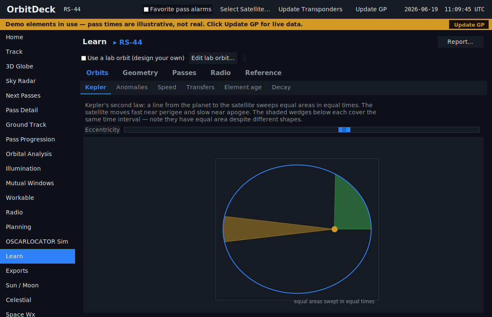</p>

The **Learn** screen gathers OrbitDeck's standalone teaching tools, so they stay
out of the operating screens. Each reuses the same models as the rest of the
program, so the numbers match. The tools are organised into five groups, chosen
from a category row above the tab strip: **Orbits** (how an orbit works),
**Geometry** (its shape and reach), **Passes** (observing from the ground),
**Radio** (working satellites), and **Reference**.

A **"Use a lab orbit"** toggle at the top lets the orbit-based tools (Coverage,
Sunlight, Element age, and the Doppler pass search) run against a satellite you
design instead of the catalog selection — open **"Edit lab orbit…"** to adjust
its elements and watch the coverage and pass geometry change.

**Orbits** group:

- **Kepler** — an equal-areas two-body demonstration with an eccentricity slider:
  the two shaded wedges cover equal time and have equal area despite different
  shapes.
- **Anomalies** — an interactive ellipse showing the three "anomalies" that
  locate a satellite along its orbit; the mean anomaly ticks evenly with time
  while the true anomaly is the real angle from perigee, and the two diverge on
  an eccentric orbit because the satellite speeds through perigee and lingers at
  apogee.
- **Speed** — orbital speed from the vis-viva law: a curve of circular-orbit
  speed versus altitude (a LEO bird races at ~7.7 km/s, a geostationary one
  ambles at ~3 km/s), with markers for the selected orbit's perigee and apogee
  speeds as you raise the eccentricity.
- **Transfers** — an interactive Hohmann-transfer calculator: the two engine
  burns needed to move between two circular altitudes, plus the extra cost of a
  plane (inclination) change, showing why changing an orbit's tilt is so
  expensive and why satellites launch into their target inclination.
- **Element age** — the selected satellite's element-set age and the estimated
  along-track error growth, with a "refresh your elements" nudge.
- **Decay** — estimated orbital lifetime versus altitude with a solar-activity
  control, showing why low satellites reenter in weeks to months while higher
  ones last for centuries, and why the ISS must reboost periodically.

**Geometry** group:

- **Slant range** — slant range versus elevation for the selected orbit's
  altitude: directly overhead the satellite is only its altitude away, but near
  the horizon it is several times farther, which is why low passes are weaker.
- **Horizon** — how far a satellite can "see" versus altitude (its footprint /
  radio-horizon distance); higher orbits reach farther, which is why they cover
  more at once and can relay to each other over the limb.
- **Track drift** — the westward shift of the ground track per orbit caused by
  Earth's rotation, why several workable passes cluster together followed by a
  gap, and when a whole number of orbits per day makes the track repeat.
- **Precession** — how the Earth's equatorial bulge slowly rotates an orbit's
  plane (nodal precession), plotted versus inclination, with the
  **sun-synchronous** rate marked and the sun-sync inclination found for the
  chosen altitude — the orbit that crosses the equator at the same local time
  every day, used by imaging and weather satellites.
- **Constellation** — an estimate of how many evenly-spaced satellites in one
  orbital plane are needed for continuous coverage of a point, versus altitude:
  many for a low orbit, only three at geostationary altitude — why LEO internet
  constellations need thousands of satellites and navigation systems need dozens.

**Passes** group:

- **Coverage** — accumulates the selected satellite's footprint over 24 hours
  into a heat map (brighter = revisited more often), with a percent-of-Earth
  read-out, showing why a polar orbit favours the poles while a low-inclination
  one only covers a band.
- **Sunlight** — the full-sun threshold **beta\*** versus altitude, with reference
  orbits marked; above this beta angle the satellite never enters eclipse.
- **Eclipse** — a lit-versus-shadow timeline over the next several orbits,
  showing when and for how long the satellite runs on battery in the Earth's
  shadow each orbit, and how that depends on the beta angle.
- **Pointing** — a sky-track polar plot of the next pass in azimuth (compass
  bearing) and elevation, with AOS and LOS marked. It explains why low passes are
  hard (longer slant range, terrain and building obstruction, more atmosphere)
  and high passes are easy.
- **Grid squares** — the Maidenhead locator system that operators exchange via
  satellite: enter any location (or use "my location") to see its grid on a
  field/square map, with the field, square, and subsquare broken out.

**Radio** group:

- **Transponder** — an interactive diagram of the selected satellite's actual
  transponder. The uplink and downlink passbands are drawn to scale; drag the
  slider to move your transmit frequency and a connector shows where your signal
  lands on the downlink. On an **inverting** linear transponder (e.g. RS-44),
  tuning your uplink up moves the downlink down — shown directly. FM birds appear
  as a single channel.
- **Doppler** — plots the frequency shift across the next pass. For a linear bird
  it shows **both** the uplink and downlink legs; the higher band swings more, and
  the tip explains keeping the downlink centred by retuning the uplink (the
  opposite direction on an inverting transponder).
- **Link budget** — an interactive free-space sandbox: set range, frequency, TX
  power, antenna gains and mode, and read the received power, path loss, and a
  **per-mode workable verdict** (FM needs a stronger signal than narrow SSB/CW),
  plus a chart of free-space loss across the amateur satellite bands.
- **Duplex practice** — a hands-on widget that simulates a pass on a linear bird.
  Scrub the time slider and adjust your uplink offset to keep your own signal on
  the fixed target downlink; the display shows where your signal actually lands,
  an optional ideal-tuning hint, and (on an inverting transponder) reminds you to
  tune the opposite way. This builds the single hardest real operating skill —
  following your own downlink through Doppler.
- **Antenna** — an interactive antenna gain pattern with a gain slider, showing
  the gain-versus-beamwidth trade-off: a high-gain beam is narrow and must be
  aimed and tracked, while a low-gain omni hears the whole sky weakly.

**Reference** group:

- **Reference** — a scrollable reference covering operating **modes** (which band
  is up/down), why satellites use **circular polarization**, the main satellite
  **subsystems**, **beacons & telemetry**, **operating practice & etiquette**, the
  amateur-satellite **bands & licensing**, **modulation modes**, **noise &
  sensitivity** (why the downlink is the weak link), **time & reference frames**
  (UTC and the element epoch), the **coordinate frames** the whole program
  computes in (ECI / ECEF / topocentric), a short **history of amateur
  satellites** (OSCAR-1 to CubeSats), and the bigger picture of
  **constellations**.
- **Handouts** — saves a four-page classroom handout: page one covers the
  orbital elements, orbit families, and key formulas; page two covers transponder
  types, modes, Doppler, and the link; page three covers operating practice,
  bands & licensing, and antennas; page four covers orbital speed, slant range, the radio horizon, ground-track drift, and constellations.

### 3.17 Exports

<p align="center">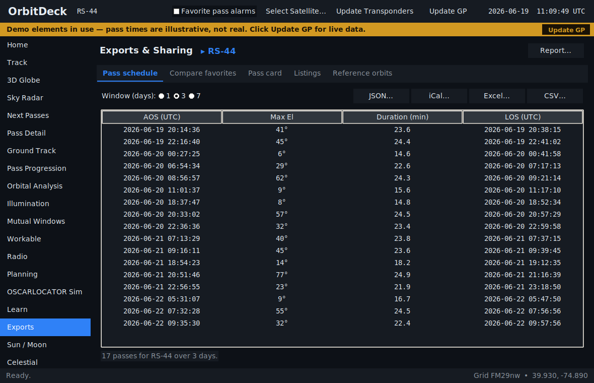</p>

Data export and sharing, in five tabs:

- **Pass schedule** — the next 1/3/7 days of passes for the selected satellite,
  exportable to **CSV**, **Excel (.xlsx)**, **iCal (.ics)**, or **JSON**. The
  iCal events carry a **10-minute reminder alarm**, so passes show up in your
  calendar app with a heads-up. (Excel export needs the optional `openpyxl`
  package; CSV needs nothing extra.)
- **Compare favorites** — a side-by-side table of your favorited satellites over
  a 1/3/7-day window: how many passes each has and its single best pass (time,
  max elevation, duration). Exportable to CSV. If you have no favorites, the
  first few catalog satellites are used.
- **Pass card** — a shareable single-image summary of a pass: the sky-track
  polar plot, the Doppler curve, and the key facts (AOS/TCA/LOS, duration,
  azimuth sweep, and a 0–100 quality score). Pick **which upcoming pass** from
  the selector; the card is **rendered right on the screen** so you can preview
  it. **Save pass card…** exports it as a PNG and **Refresh passes** re-scans.
  Good for dropping into a club chat or attaching to a log entry.
- **Listings** — Nova-style **tabular ephemerides** for the selected satellite,
  with a step interval (30 s–5 min), a span (2–24 h), and a **visible-only**
  filter, in three sub-tabs. **One observer** is a stepped position listing
  (time, az, el, range, range-rate, sub-point, altitude, sunlit) from your
  primary site. **AOS / LOS** is a compact pass list (AOS, LOS, duration, max
  elevation, AOS/LOS azimuths) for seeing many passes at once. **Two observers**
  is a stepped listing that shows your station *and* a chosen **secondary site**
  (picked from the sites you set up on the Sites screen) side by side from a
  single ephemeris. Each sub-listing exports to **CSV**.
- **Reference orbits** — a printable PDF table of *reference orbits* for the next
  **30 or 60 days**, for the **selected satellite** or **all favorites** (one per
  page). For each UTC day it lists the **first equator crossing** — ascending for
  northern-hemisphere stations, descending for southern — giving the **UTC time**
  and **sub-longitude**. Those are the two numbers you set on a physical
  OSCARLOCATOR to line up the path-arc overlay for that day's first pass, then
  step forward orbit by orbit. (Geosynchronous/high satellites, which hold a fixed
  sub-point, are reported as having no equator-crossing reference orbits.)

### 3.18 Sun / Moon

<p align="center"></p>

Solar and lunar **azimuth/elevation** for your site, plus the **Moon phase and
illumination** percentage. Handy for visual passes and for knowing sky
conditions.

### 3.19 Celestial

<p align="center">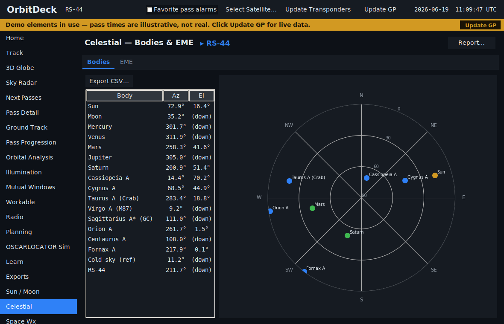</p>

Tracking and analysis for objects beyond satellites, in two tabs:

- **Bodies** — the live **azimuth/elevation** of the **Sun**, **Moon**, the
  **planets** (Mercury, Venus, Mars, Jupiter, Saturn) and a set of bright
  **cosmic radio sources** (Cassiopeia A, Cygnus A, Taurus A / Crab, Virgo A,
  Sagittarius A\* at the galactic centre, Orion A, Centaurus A, Fornax A), a
  **cold-sky** reference direction, and the **currently selected satellite**
  (drawn as a star). Everything that is above the horizon is plotted on a polar
  sky map (zenith centre, horizon rim) and listed in a table. Useful for antenna
  calibration, sun/moon-noise measurements, and radio astronomy. The table
  exports to **CSV**.
- **EME** — an **Earth-Moon-Earth (moon-bounce)** analysis panel. Pick a band
  (6 m / 2 m / 70 cm / 23 cm / 3 cm) and it shows the **Moon's az/el and
  distance**, the **total path loss** for that band (around 252 dB on 2 m, rising
  to ~288 dB at 10 GHz), the **self-echo Doppler** on your own returning signal,
  the round-trip echo delay (~2.5 s), and a **cold-sky temperature** estimate.
  Enter a second station (grid or lat,lon) to list the **common-Moon-visibility
  windows** — the times both stations can see the Moon at once, which is the
  requirement for an EME QSO. Windows export to **CSV**.

Positions are low-precision (good to a fraction of a degree) — enough for
pointing and planning, not ephemeris-grade work.

### 3.20 Space Wx

Space-weather indices for HF/propagation context: the **solar 10.7 cm flux**,
planetary **Kp**, and the **A index**, sourced from NOAA SWPC, each with a
plain-language level and an operating outlook. Cached to disk so it still
displays offline.

### 3.21 Satellites

The **catalog** screen and the place you choose what everything else acts on, in
three tabs.

**Catalog** is the main list:

- **Filter** the list by typing.
- **Select** a satellite (it becomes the active satellite everywhere).
- **Favorite** with the **space bar** (or the "Toggle favorite" button); the ★
  marks favorites, which populate the Home map and the favorites schedule.
- **Fetch transponders** for the selected bird (from SatNOGS).
- **Add a manually-entered satellite** by its GP mean elements; manual sats
  persist across catalog refreshes. You can also **Edit** a manual satellite
  (the form opens pre-filled with its current elements) or **Delete** it. Only
  manually-entered satellites can be edited or deleted — satellites from the
  downloaded catalog are protected — and deleting one also removes it from your
  favorites.

**By type** groups the whole catalog by **SatNOGS transponder kind** — **Linear
transponder**, **FM transponder**, **Digital transponder**, **Beacon / CW**,
**Other**, and **No transponder data** — with a count per group and the downlink
and transponder kinds shown for each satellite. Filter to a single group, sort by
**name / NORAD / period**, double-click to start tracking a bird, and **Export
CSV**. (Grouping is only as complete as the transponder data you have loaded —
use **Update Transponders** for the full SatNOGS database.)

**What's up now** scans the **whole catalog** for satellites currently above your
horizon, sorted by elevation, with a minimum-elevation floor (0/5/10/20°). It
shows each satellite's az/el, range, sub-point, altitude and sunlit flag;
double-click to start tracking one, or **Export CSV**.

### 3.22 Sites

Manage the observer **locations** OrbitDeck works from, in two tabs:

- **Manage sites** — give the **primary site** a nickname (it is the location
  that drives every other screen — Track, passes, Doppler, footprints, and so
  on), and build a table of **secondary sites**: a club station, portable spots,
  or friends' QTHs. Add each by nickname and a Maidenhead grid or `lat,lon`
  (plus optional altitude); names are kept unique. Secondary sites are saved and
  persist across sessions, and are used only for comparison — they do not change
  what the rest of the app tracks.
- **Compare passes** — the selected satellite's upcoming passes (1–3 days)
  across **every site at once**: how many passes each gets, the next AOS and its
  max elevation, and each site's best pass. The primary site is listed first.
  Export to **CSV** or a printable **PDF report**.

### 3.23 Settings

The Settings screen has two tabs: **Observer & preferences** and **About**.

On **Observer & preferences**, configure:

- **Observer site** — latitude, longitude, and altitude, or a Maidenhead grid
  square. (You can nickname this primary site on the **Sites** screen.)
- **GP element source** — where Update GP fetches elements from: **AMSAT**, a
  **CelesTrak category** (amateur, cubesat, stations, weather, GPS, etc.), or a
  **custom OMM-JSON URL**.
- **Minimum elevation** — the default floor (in degrees) applied to pass tables
  and reports across the app.
- **Page size** — under **Printing**, the paper size for every printable PDF:
  **US Letter** (the default) or **A4**. This applies globally to the
  OSCARLOCATOR, reports, reference sheets, and handouts. The OSCARLOCATOR disc
  stays the same physical size on either paper, so overlays still register — just
  remember to keep printing at **100% / actual size** (see below).

The **About** tab shows the program version, the author credit (**Paul Stoetzer,
N8HM**), a link to the project on GitHub
(github.com/prstoetzer/OrbitDeck), and a suggestion to support **AMSAT**
(www.amsat.org) if you find OrbitDeck useful. See *Supporting AMSAT* below.

---

## 4. The OSCARLOCATOR system

The OSCARLOCATOR is a classic predict-by-hand tool: a polar map of the Earth with
a transparent, rotatable overlay of the satellite's ground track. You line the
track's equator crossing up with the longitude where the satellite crosses the
equator, and read off where it will be minute by minute.

OrbitDeck supports it two ways:

- **Interactive** — the [OSCARLOCATOR Sim](#311-oscarlocator-sim) screen.
- **Printable** — a multi-page PDF you print (at **100% / actual size**) onto
  paper and transparency film to build a physical OSCARLOCATOR. Export it from
  the **Track** screen or the **Sim** screen.

> **Printing checklist** (the overlays only register if you follow it):
> 1. Print **every** page at **100% / actual size** — turn off "fit to page",
>    "shrink to fit", and any scaling in the print dialog.
> 2. Print the **base map** on paper or card; print the **range-circle** and
>    **path-arc** pages on **transparency film**.
> 3. **Pin or pivot the overlays through the exact centre** so they rotate about
>    the same point as the map.
>
> A small OrbitDeck credit (and version) is printed in the bottom corner of the
> base-map sheets; see [§9](#9-author--supporting-amsat) for author and AMSAT
> information.

### Printable pages

- **Base map** — an azimuthal-equidistant map with a lat/lon graticule and
  full-resolution coastlines. The outer ring carries **per-degree tick marks**
  (with longer marks every 5° and 10°), so the rim reads like a protractor — handy
  for registering stacked overlays and measuring the per-pass arc rotation to the
  degree. A small OrbitDeck credit sits unobtrusively in the bottom corner of the
  printed sheet. Choose:
  - **Polar** (auto N/S from your latitude) — the generic ARRL/PE1RAH-style map
    anyone can use together with the equator-crossing list. 0° longitude is at
    the bottom; east increases counter-clockwise on the northern sheet (the
    conventional, un-mirrored orientation), mirrored on the southern sheet.
  - **QTH-centered** — a personalized map centered on your station, capped so it
    does not over-show the opposite hemisphere.
- **Map + Footprint at QTH** — a single QTH-centered sheet that draws the
  footprint **range circle** right on the map (centered on your station), so no
  separate transparency is needed. It carries the full set of readouts inside the
  circle: **azimuth** spokes and degree labels with N/E/S/W cardinals, **elevation
  rings** (0/10/30/60°, the 0° ring being the footprint edge), and **dashed
  ground-distance rings labelled in km** out to the footprint edge — so you can
  read the bearing, elevation, and ground distance to the sub-point directly off
  the one sheet. The footprint circle itself is kept clean — the azimuth labels
  and the elevation rings come from the base map underneath, so they aren't
  repeated on the footprint. Use the path-arc overlay on top to see when the
  satellite enters the circle. The **polar** version of this sheet carries the
  same elevation and distance rings, drawn as the correct off-centre rings around
  your station, and the footprint uses the identical red-circle style. (The
  standalone footprint transparency in the 3-sheet set keeps its own full azimuth
  rose and km labels, since it prints on its own.)
- **Footprint transparency** — the **range circle**, the radius of the
  satellite's coverage footprint at its **mean orbital altitude**, with distance
  rings and azimuth radials. Pin it through the centre cross **over your QTH**:
  the satellite is in range whenever its ground track (the path-arc overlay) is
  **inside** this circle, so you read AOS and LOS where the arc crosses it. (When
  the QTH-centred base map is used, the 0° elevation ring is the same circle, so
  this transparency is mainly for the polar map.) On the **polar** base map the
  true coverage edge is a slight oval rather than a perfect circle (the polar map
  is centred on the pole, not your station), so for the polar workflow the circle
  is drawn a few percent larger — a single generic size chosen to best fit that
  oval across the latitudes where most operators live. The sheet notes the
  enlargement. On the QTH-centred map the circle is exact and is left unchanged.
- **Path-arc overlay** — the rotatable ground-track transparency, with **minute
  tick marks** (straight marks across the track; longer, labelled marks every 10
  minutes), a bold **"EQX (0 min)"** marker showing which radial to line up with
  the equator-crossing longitude on the map, and a per-pass node-advance
  indicator. The track is referenced to the **ascending node** for northern
  sheets and the **descending node** for southern sheets, with minute 0 on the
  equator.

### Print options

The **"Make printable OSCARLOCATOR…"** button (on Track and on the Sim) opens a
single options dialog where you choose:

- **Base map** — polar (generic, works for any QTH via the equator-crossing list)
  or QTH-centred (personalised to your station).
- **Range circle** — a separate transparency (3-page set) or drawn directly on
  the base map at your QTH (2-page set).
- **Reduced-text transparencies** — an optional clean style. With it on, the base
  map carries **all** the how-to-use instructions and the transparency pages have
  no text outside their circular area except the azimuth labels. The base map is
  kept generic so the set can be reused with any satellite; the range-circle
  transparency just names the satellite unobtrusively inside the circle; and the
  path-arc transparency lists the satellite name, inclination, period, and the
  per-pass advance inside the circle. (The standard fully-labelled style is
  unchanged — reduced text is a separate choice.)

### How to use the printed set

1. Print all pages at **100% (actual size)** so they register on top of each
   other.
2. Print the base map on paper or card; print the path-arc (and range-circle)
   pages on transparency film.
3. Pin the transparencies through the center so they rotate.
4. From the **EQX Map** page (Orbital Analysis) or the **Sim** page's
   crossing list, read the **longitude** of the next equator crossing.
5. Rotate the path-arc overlay so its **EQX mark** points at that longitude on
   the base map.
6. Read along the track: each tick is one minute after the equator crossing. The
   satellite is workable while the track is inside your QTH range circle.

The interactive Sim does all of this on screen, which is the easiest way to learn
the workflow before committing to print.

---

## 5. Reports (printable PDFs)

Every satellite-specific screen has a **Report…** button that saves a clean,
printable **comprehensive PDF** for the selected satellite. It contains:

- orbital analysis,
- the next passes from your station,
- the equator-crossing schedule,
- a 3-day grid of **polar sky tracks**,
- the 60-day **illumination** raster, and
- the 30-day **pass progression** timeline.

Additional one-click reports live on specific screens:

| Report | Where |
|---|---|
| 7-day schedule for **all favorites** | Home → Passes tab |
| 3-day **polar sky-track grid** | Next Passes |
| **Mutual windows** with a DX station | Mutual Windows |
| 60-day **illumination** summary | Illumination → Illumination raster |
| **Eclipse ephemeris** (every-orbit + daily) | Illumination → Eclipse table |
| 30-day **pass progression** | Pass Progression |
| Printable **OSCARLOCATOR** | Track and OSCARLOCATOR Sim |
| **Doppler playbook** sheet (PDF) | Radio → Doppler playbook |
| Pass schedule as **CSV / Excel / iCal / JSON** | Exports → Pass schedule |
| **Favorites comparison** (CSV) | Exports → Compare favorites |
| Per-pass **card** (PNG) | Exports → Pass card |
| **Listings** (one-/two-observer, AOS/LOS) CSV | Exports → Listings |
| **Eclipse tables** (CSV) | Illumination → Eclipse table |
| **Work-a-target** / **visible passes** CSV | Planning |
| **Workable** grids/states/DXCC CSV | Workable |
| **Equator crossings** CSV | Orbital Analysis → EQX List |
| **Satellites by type** / **what's up** CSV | Satellites |

Beyond PDF reports, OrbitDeck can export **data** for use in other tools — pass
schedules as CSV, Excel, iCal (with reminder alarms), or JSON; the Doppler
playbook, favorites comparison, eclipse ephemerides, stepped listings, workable
lists, planning windows, equator crossings, and the satellite catalog (by type or
what's-up) as CSV; and a shareable per-pass card image. See
[Exports](#316-exports), [Radio](#39-radio), [Illumination](#311-illumination),
[Planning](#310-planning), and [Satellites](#320-satellites).

The **minimum elevation** set in Settings is applied throughout.

---

## 6. Data sources & staying accurate

OrbitDeck reads **GP (general perturbations) elements** in the modern CCSDS OMM
JSON format and propagates them with SGP4/SDP4.

- **Update GP** (top bar) fetches a fresh catalog from your configured source
  (Settings → GP element source): AMSAT, a CelesTrak category, or a custom URL.
  OrbitDeck queries CelesTrak's `.org` domain in JSON, only when you click the
  button (it does not poll), caches the result to disk, and handles the modern
  6- and 9-digit catalog numbers that the old TLE format cannot represent.
- **Update Transponders** refreshes the SatNOGS transponder database, which feeds
  the Track screen's frequency/Doppler display.

> **Refresh regularly.** SGP4 accuracy degrades as an element set ages; aim to
> update within one to two weeks of the element epoch. A yellow banner warns you
> when the loaded catalog is demo or stale.

Be a good citizen of CelesTrak's free service: only fetch when you actually need
fresh data. OrbitDeck already reuses the cached catalog and never auto-polls.

---

## 7. Files & where settings live

Everything persistent is stored under **`~/.orbitdeck/`**:

- your observer site and preferences (including minimum elevation and GP source),
- your favorites,
- the cached GP catalog,
- the cached transponder database, and
- the cached space-weather data.

Deleting that directory resets OrbitDeck to a first-run state.

---

## 8. OrbitTerm — the terminal UI

**OrbitTerm** is a companion application that brings the core of OrbitDeck to a
plain terminal. It is built for **headless boxes and SSH sessions** — a Raspberry
Pi at the antenna, a remote shack PC, a server with no display — where the
windowed GUI can't run. It uses only the Python standard library (`curses`), so
it needs **no extra dependencies** beyond OrbitDeck itself, and it reuses the
same propagation engine and the same `~/.orbitdeck` configuration and catalog
cache as the desktop app. Whatever station, favorites, selected satellite, and
catalog you have in the GUI are already there in OrbitTerm, and every computed
number (look angles, pass times, Doppler) matches the GUI exactly.

Radio (CAT) and rotator control remain out of scope here too — OrbitTerm tells
you where to point and what Doppler to expect, but does not key a radio.

### 8.1 Launching

```sh
orbitterm            # if installed via pip / a native package
python -m orbitterm  # from a source checkout
```

The interface is a left **navigation column** and a content pane, with a title
bar (selected satellite and your grid) and a footer that always lists the keys
available on the current screen.

<p align="center">
  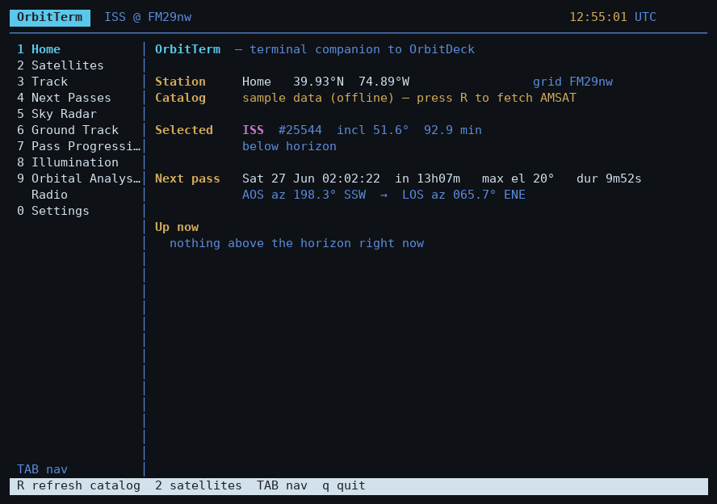
</p>

### 8.2 Navigating

- **Number keys 1–9, 0** jump straight to a screen.
- **Tab** moves focus to/from the navigation column; then **↑/↓** pick a screen
  and **Enter** (or **→**) returns to the content.
- **`[` / `]`** step to the previous / next satellite on the detail screens.
- **↑/↓, PgUp/PgDn, Home/End** move within lists.
- **Enter** selects, opens, or begins editing depending on the screen.
- **`/`** starts a search (Satellites); **`f`** toggles a favorite.
- **`R`** fetches a fresh AMSAT catalog online (Home and Settings).
- **`q`** quits.

### 8.3 The screens

**Home** — a dashboard: your station and grid, catalog freshness, the selected
satellite's live look and next pass, and a list of everything currently above
the horizon.

**Satellites** — the catalog as a scrollable, searchable list (press **`/`** to
filter by name or NORAD id). Each row shows inclination, period, altitude and a
live up/down status. **`f`** favorites a satellite (favorites sort to the top);
**Enter** selects it for the detail screens.

**Track** — the full live look for the selected satellite: azimuth and elevation
(with a bar), slant range, range rate, sub-point, altitude, sunlit/eclipse, and
the Sun's position, plus a naked-eye-visibility check and an AOS/LOS countdown.

<p align="center">
  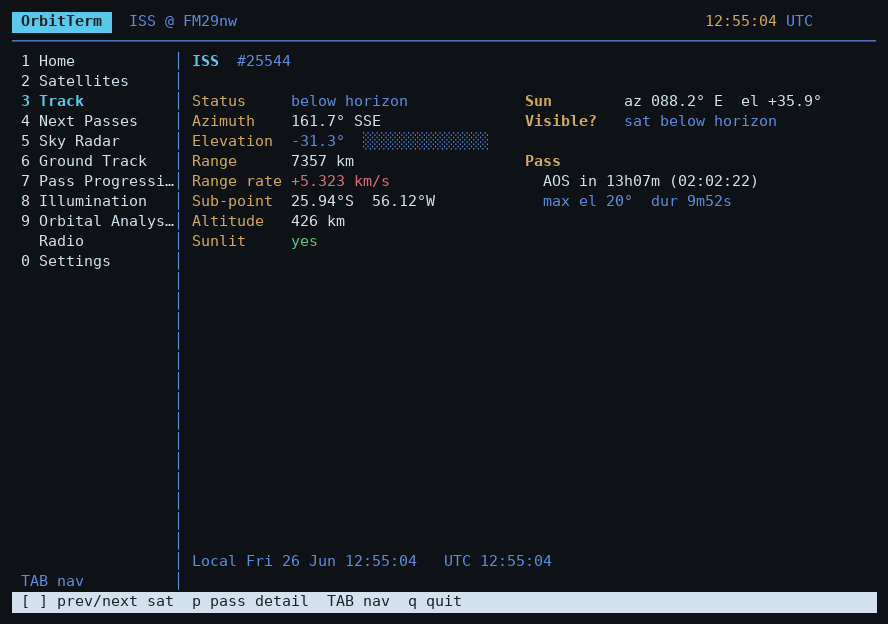
</p>

**Next Passes** — a scrollable table of upcoming passes (date, AOS / TCA / LOS,
maximum elevation, and AOS/LOS azimuths). Max elevation is colour-coded by pass
quality. **`e`/`E`** lowers/raises the minimum-elevation filter; **Enter** opens
the highlighted pass in Pass Detail.

<p align="center">
  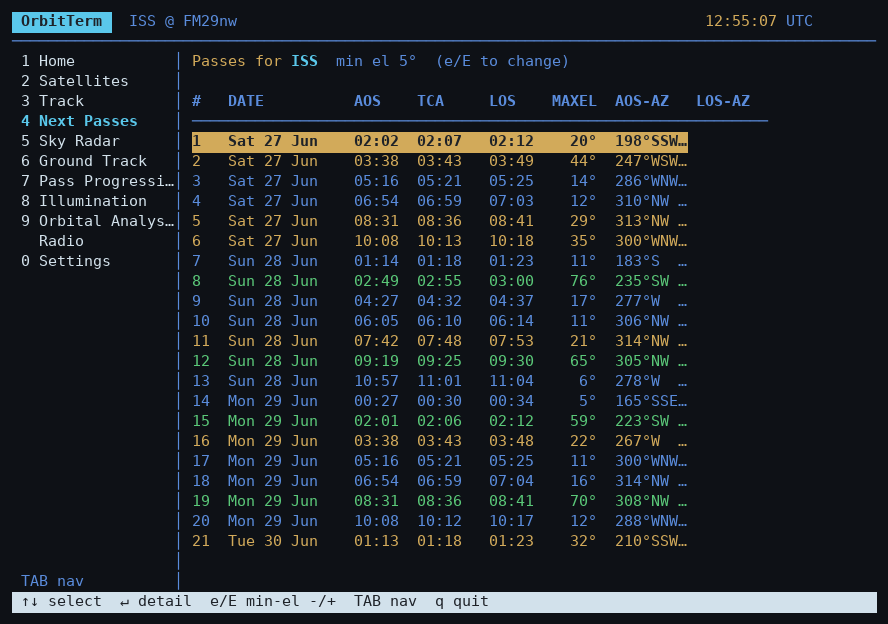
</p>

**Pass Detail** — the AOS/TCA/LOS events for one pass with their azimuths and
elevations, plus an **ASCII elevation profile** of the whole pass that peaks at
TCA and marks the current time. **`n`** jumps to the next pass.

**Sky Radar** — an ASCII polar sky plot of everything above the horizon right
now: north up, with elevation rings (the rim is the horizon, the centre is
overhead). Each satellite is a lettered marker keyed to a side list.

**Ground Track** — an ASCII world map showing the selected satellite's sub-point
(**◉**), its ground track (past as dots, the next orbit as **+**), its coverage
footprint (**°**), and your station (**▲**).

<p align="center">
  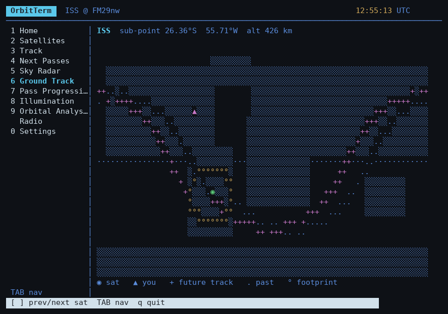
</p>

**Pass Progression** — every pass of the selected satellite over the next N days
(10 by default; **`+`/`-`** loads more or fewer in 7-day steps), drawn as one
24-hour timeline per day. Each pass sits at its time of day, its width is its
duration, and its shade encodes maximum elevation, so you can watch the pass
times drift from day to day at a glance.

<p align="center">
  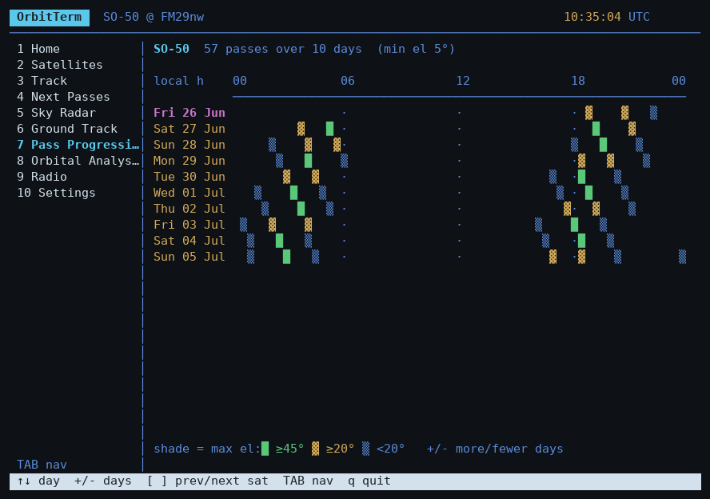
</p>

**Illumination** — the selected satellite's sunlit/eclipse picture, in two views
toggled with **`v`**. The *raster* shows a 30-day window with days across the
bottom and minutes-into-orbit up the side; bright cells are sunlit, blanks are
umbral eclipse, and the footer gives the mean eclipse fraction per orbit. Scroll
the window forward and back in time with **`←`/`→`** (**`0`** resets). The
*eclipse table* is an umbral-eclipse ephemeris over a selectable span
(**`+`/`-`**, 1–14 days): press **`s`** to switch between the per-orbit list
(enter, exit, duration, the sunlight interval to the next eclipse, and the
orbit-plane beta angle) and the per-day summary (eclipse count, total and longest
shadow time, percent of the day in shadow, and beta). High beta means shallow,
short eclipses — or none at all in continuous sunlight. This is the data for
power-budget reasoning, matching the desktop Illumination screen.

<p align="center">
  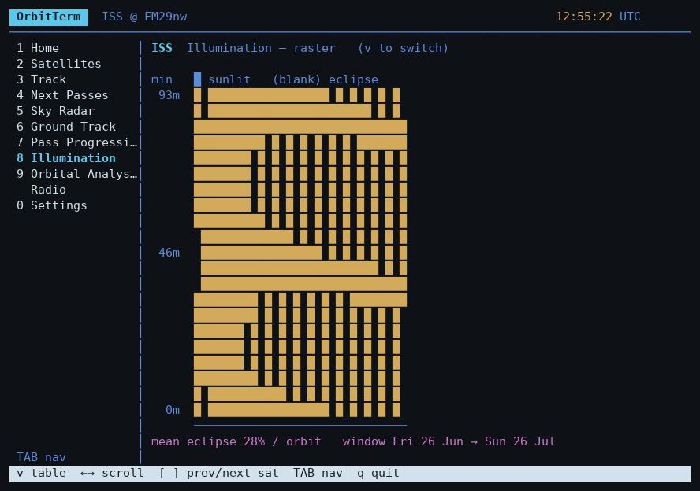
</p>

**Orbital Analysis** — the full element set plus derived quantities: semi-major
axis, apogee/perigee, J2 node and perigee drift, sun-synchronicity, LTAN,
beta\* threshold, ground-track shift per orbit, repeat-track cycle, longest
possible pass, a decay estimate, and the live mean/true anomaly.

<p align="center">
  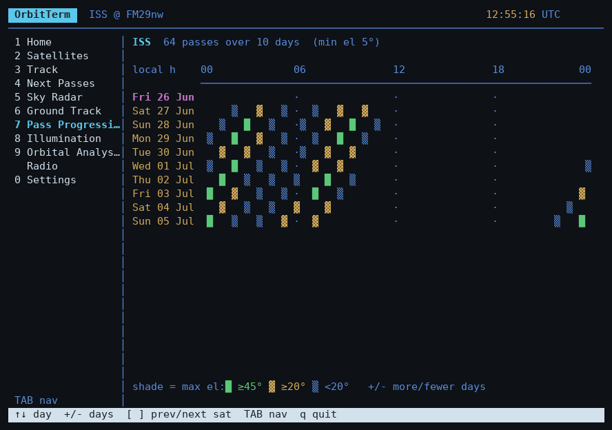
</p>

**Radio** — Doppler tuning for the selected transponder (**`t`** cycles through
a satellite's transponders): the nominal downlink/uplink, the **tune-now** dials
corrected for the current range rate, the shift, and a live **downlink-Doppler
curve** across the next pass (high as the bird approaches, sweeping down through
zero at TCA to low as it recedes).

<p align="center">
  
</p>

**Settings** — edit your station latitude, longitude, altitude and name, and the
minimum-elevation filter, with the resulting Maidenhead grid shown live. Changes
are written to the shared `~/.orbitdeck/config.json`, so they apply to the GUI
too. **`R`** refreshes the catalog.

### 8.4 Notes

- The ASCII world map and sky radar are **schematic aids** for orienting the eye;
  the underlying geometry (az/el, sub-point, Doppler, pass times) is the same
  precise engine output as the GUI.
- Deep-space orbits (period ≥ 225 min) are flagged as *approximate* when the full
  reference SDP4 backend isn't installed, exactly as in the GUI.
- A terminal of at least ~80×24 is recommended; the map and radar use whatever
  space is available and scale down gracefully on smaller windows.

---

## 9. Troubleshooting

**Pass times look wrong / a yellow banner is showing.** You are on demo or stale
elements. Click **Update GP**. If you just did, check that your **GP source** in
Settings is reachable.

**Update GP fails.** OrbitDeck surfaces the HTTP problem. A **403** usually means
the source is rate-limiting you (CelesTrak updates only every couple of hours —
wait and reuse cached data); a **404** means the group name or URL is wrong.
OrbitDeck keeps your existing catalog rather than wiping it on a failed fetch.

**No Doppler frequencies on Track.** Fetch transponders for the satellite on the
**Satellites** screen (or **Update Transponders** in the top bar). Some
satellites have no transponder entries; you can add one manually on Track.

**The app won't start — tkinter missing.** Install Tk: `sudo apt install
python3-tk` (Debian/Ubuntu/Raspberry Pi OS), `sudo dnf install python3-tkinter`
(Fedora), or `sudo pacman -S tk` (Arch). The python.org installers for Windows
and macOS already include it. Full per-platform steps are in
[INSTALL.md](INSTALL.md).

**Coastlines look coarse.** Full-resolution coastlines come from cartopy; if
cartopy isn't installed (or its map data hasn't been downloaded yet), OrbitDeck
falls back to a lower-resolution bundled outline. Install it with
`pip install "orbitdeck[maps]"` (it is one of the strongly-recommended extras).

**A reduced-accuracy warning on a deep-space bird.** When the bundled
pure-Python propagator is used for a deep-space object (period ≥ 225 min — GEO,
Molniya, AO-7), its deep-space terms are only approximate and OrbitDeck flags it.
Install the reference backend — `pip install "orbitdeck[accurate]"` — to remove
the warning and restore full accuracy (and faster propagation generally).

**Printed OSCARLOCATOR overlays don't register.** Make sure every page is printed
at **100% / actual size** (no "fit to page" scaling), and that the transparencies
are pinned through the exact center.

**OrbitTerm shows odd characters or a broken layout.** Your terminal needs UTF-8
and a reasonable size (~80×24 minimum). Over SSH, ensure a UTF-8 locale and a
`TERM` your client understands (e.g. `xterm-256color`). OrbitTerm needs no
graphical display, so it is the right choice on a headless Pi or server where the
GUI can't run.

---

## 10. Author & supporting AMSAT

OrbitDeck is written by **Paul Stoetzer, N8HM**. The source code, issue tracker,
and releases are on GitHub at **github.com/prstoetzer/OrbitDeck**.

If you find OrbitDeck useful, please consider **joining and/or donating to AMSAT**
— the Radio Amateur Satellite Corporation — at **www.amsat.org**.

AMSAT is a volunteer, member-supported non-profit organization that designs,
builds, arranges launches for, and operates the amateur radio satellites that
OrbitDeck is built to track. Founded in 1969, AMSAT has kept amateur radio in
space for over half a century, from the early OSCAR satellites through today's
linear-transponder and FM birds that this program helps you work. The
organization receives no government funding — membership dues and donations are
what fund the design and launch of the next generation of amateur satellites.
Supporting AMSAT directly helps keep these satellites, and the hobby of satellite
operating, alive.

---

*OrbitDeck is tracking-and-analysis software. Always confirm critical operating
information against live, current element sets.*
